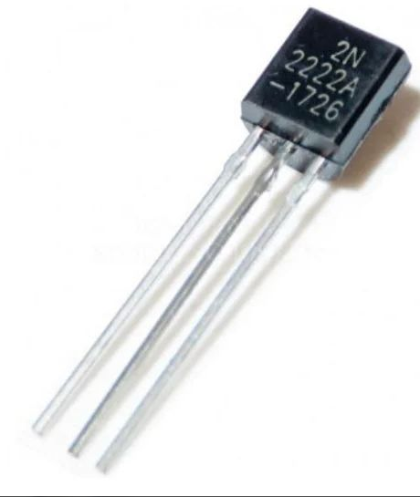
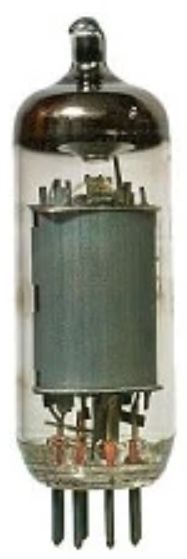
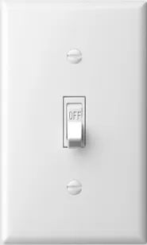
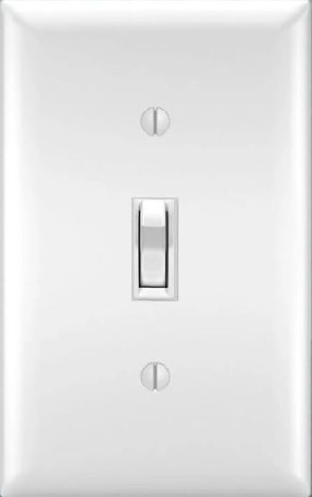
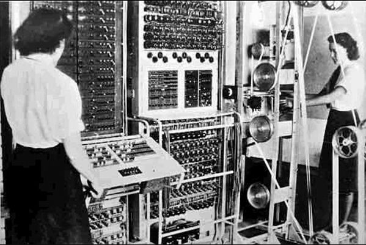
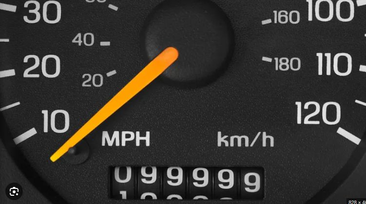
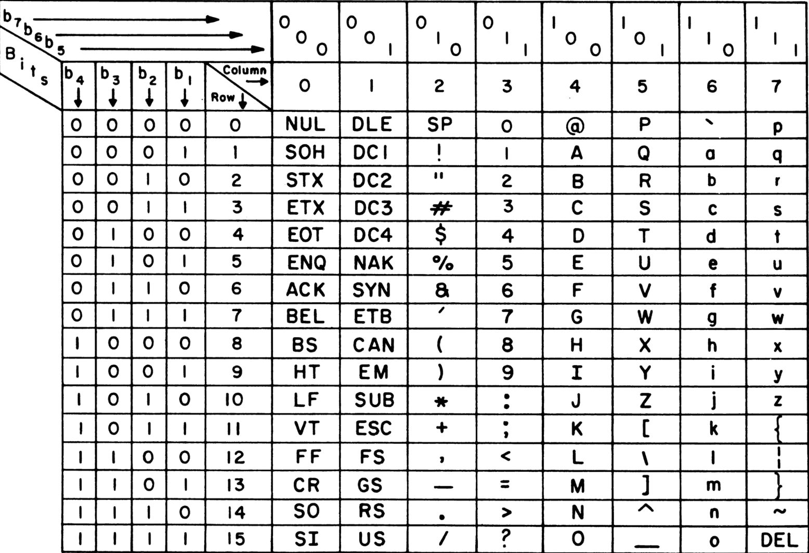
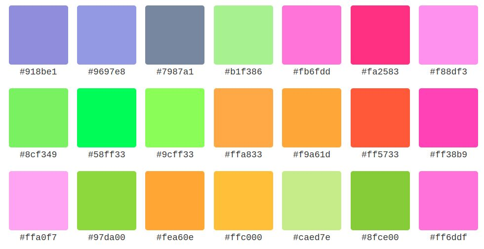

# Binary Numbers and Logical (Bitwise) Operations (AND, OR, NOT)
**CS 1109 · Summer 2024 — Enhanced Notes**

---

## 1 · Why Is Our Number System Base-10?

A number system is called **base-x** if exactly *x* distinct symbols can be written as a single digit. In base-10 (decimal), those symbols are 0–9.

> 💡 **Why 10?**
> Most likely because humans have 10 fingers — a convenient counting tool. But 10 is ultimately arbitrary. Base-5, base-12, or base-60 would all work. In fact, Babylonians used base-60, which is why we still have 60 seconds and 60 minutes today.
>
> The only reason any number system wins is *convenience*.

---

## 2 · How Does a Computer Work?

Every modern computer is built from billions of **transistors** — tiny electronic switches. Early computers used **vacuum tubes** for the same job. Both devices do one thing: switch current *on* or *off*.

| Component    | Era           | What it does                                                          |
|--------------|---------------|-----------------------------------------------------------------------|
| Vacuum tube  | 1940s–50s     | Large glass tube that controls electrical current (on/off).           |
| Transistor   | 1960s–present | Microscopic semiconductor. Faster, smaller, far less power.           |

*Left: a modern transistor (2N2222A). Right: a vacuum tube — both are just on/off switches.*

 

Both devices are electrically controlled on/off switches — the transistor is just microscopic and vastly more efficient.

An electrical device with an on and off state — like a light switch:

> ⚡ **Key insight:** An on/off switch can represent exactly two states. Two states = two digits = **binary**.

---

## 3 · Binary (Base-2)

Because transistors only have two states, computers use **base-2 (binary)**. Only two symbols exist: **0** (off) and **1** (on). Chaining multiple switches together lets us represent larger numbers.

| Symbol | Switch state |
|--------|-------------|
| 0      | OFF  |
| 1      | ON    |

### Two switches = four combinations (0–3)

| Left switch | Right switch | Decimal | Binary |
|-------------|--------------|---------|--------|
| OFF (0)     | OFF (0)      | 0       | 00     |
| OFF (0)     | ON  (1)      | 1       | 01     |
| ON  (1)     | OFF (0)      | 2       | 10     |
| ON  (1)     | ON  (1)      | 3       | 11     |

> The left switch represents the **bigger** place value (the 2s place), just like the left digit in decimal represents the bigger value. ON=1, OFF=0 — so ON+OFF = `10` in binary = 2 in decimal.

Imagine what we could do with thousands of switches:

*An early vacuum-tube computer — essentially thousands of on/off switches working together.*

---

## 4 · Bits — Each Extra One Doubles Your Range

A single binary digit is called a **bit** — a portmanteau of "*bi*nary digi*t*". Every extra bit you add *doubles* the count of numbers you can express, because every existing pattern can now start with 0 *or* 1.

| Bits        | Formula | Values expressible | Range                          |
|-------------|---------|-------------------|--------------------------------|
| 1           | 2^1     | 2                 | 0 to 1                         |
| 2           | 2^2     | 4                 | 0 to 3                         |
| 4 (nibble)  | 2^4     | 16                | 0 to 15                        |
| 8 (byte)    | 2^8     | 256               | 0 to 255                       |
| 16          | 2^16    | 65,536            | 0 to 65,535                    |
| 32          | 2^32    | ~4.3 billion      | 0 to 4,294,967,295             |
| 64          | 2^64    | ~18.4 quintillion | 0 to 18,446,744,073,709,551,615|

---

## 5 · Converting Binary to Decimal

Every digit position represents a **power of the base**, counted from the right starting at 0. In decimal, positions are powers of 10. In binary, powers of 2. Multiply each digit by its position's value, then sum everything up.

### Decimal refresher: how 4096 works

| Digit              | 4      | 0      | 9      | 6      |
|--------------------|--------|--------|--------|--------|
| Position (right=0) | 3      | 2      | 1      | 0      |
| 10 ^ position      | 10^3   | 10^2   | 10^1   | 10^0   |
| Position value     | 1000   | 100    | 10     | 1      |
| Digit × value      | 4000   | 0      | 90     | 6      |

**4000 + 0 + 90 + 6 = 4096**

### Binary example: convert 1011 to decimal

Replace base 10 with base 2 — everything else is identical:

| Digit          | 1    | 0    | 1    | 1    |
|----------------|------|------|------|------|
| Position       | 3    | 2    | 1    | 0    |
| 2 ^ position   | 2^3  | 2^2  | 2^1  | 2^0  |
| Position value | 8    | 4    | 2    | 1    |
| Digit × value  | 8    | 0    | 2    | 1    |

> **8 + 0 + 2 + 1 = 11 → 1011 in binary = 11 in decimal**

---

## 6 · Binary Arithmetic

### Addition

Works exactly like decimal addition — column by column, right to left. The only new rule: **1 + 1 = 10 in binary** (write 0, carry 1 to the next column). This is identical to how 9 + 1 = 10 in decimal: write 0, carry 1.

#### Example: 5 + 9 = 14

|           | Bit 3 | Bit 2 | Bit 1 | Bit 0 |
|-----------|-------|-------|-------|-------|
| Carry     |       | 1     | 1     |       |
| X = 5     | 0     | 1     | 0     | 1     |
| Y = 9     | 1     | 0     | 0     | 1     |
| **Result**| **1** | **1** | **1** | **0** |

Result `1110`: 8+4+2+0 = **14** ✓

---

### Integer Overflow: 15 + 1 in 4 bits

A 4-bit register holds a maximum of `1111` = 15. Adding 1 produces a carry into a **5th bit that doesn't exist**. The result wraps back to `0000` = 0. This is called **integer overflow** — a real bug in C, C++, and Java if you exceed your type's size. Python avoids it by growing integers automatically.

|                | Bit 3    | Bit 2 | Bit 1 | Bit 0 |
|----------------|----------|-------|-------|-------|
| Carry          | (1) lost | 1     | 1     | 1     |
| X = 15         | 1        | 1     | 1     | 1     |
| Y = 1          | 0        | 0     | 0     | 1     |
| **Result = 0!**| **0**    | **0** | **0** | **0** |

Just like an odometer rolling over from 99999 back to 00000:

> ⚠ **15 + 1 = 0** because the carry bit overflows out of the 4-bit boundary. Always know the max value of your integer type in typed languages.

---

### Subtraction (positive results only)

Work right to left. When you need to subtract a larger digit from a smaller one, **borrow** from the next column to the left. Borrowing adds 2 to the current column (because each column is worth 2x the column to its right — same logic as borrowing 10 in decimal).

#### Example: 11 − 5 = 6

|            | Bit 3 | Bit 2      | Bit 1 | Bit 0 |
|------------|-------|------------|-------|-------|
| X = 11     | 1     | 0 (borrow) | 1     | 1     |
| Y = 5      | 0     | 1          | 0     | 1     |
| **Result** | **0** | **1**      | **1** | **0** |

Result `0110`: 0+4+2+0 = **6** ✓

---

## 7 · Logical (Bitwise) Operations

These operations apply a rule to each pair of bits independently. They are the foundation of all digital circuits and low-level programming.

### AND
Output is 1 only when **both** inputs are 1. Think: both must be true.

| A | B | A AND B |
|---|---|---------|
| 0 | 0 | 0       |
| 0 | 1 | 0       |
| 1 | 0 | 0       |
| 1 | 1 | 1       |

### OR
Output is 1 when **at least one** input is 1. Think: either must be true.

| A | B | A OR B |
|---|---|--------|
| 0 | 0 | 0      |
| 0 | 1 | 1      |
| 1 | 0 | 1      |
| 1 | 1 | 1      |

### NOT
Flips a single bit: 0 becomes 1, 1 becomes 0. Also called a complement.

| A | NOT A |
|---|-------|
| 0 | 1     |
| 1 | 0     |

---

## 8 · Binary Sizes

As data grows we group bits and give the groups names. Each step is 1024× (2^10) the previous — not 1000×, despite the metric-sounding prefixes.

| Term          | Size          | Common use                                    |
|---------------|---------------|-----------------------------------------------|
| Bit           | 1 binary digit| Smallest unit; one transistor state           |
| Nibble        | 4 bits        | One hex digit                                 |
| Byte          | 8 bits        | One ASCII character; smallest addressable memory unit |
| Kilobyte (KB) | 1,024 bytes   | A short text file                             |
| Megabyte (MB) | 1,024 KB      | A photo; one minute of audio                  |
| Gigabyte (GB) | 1,024 MB      | A movie; a phone app                          |
| Terabyte (TB) | 1,024 GB      | A hard drive; large database                  |

> 📌 **Note on 'kilo':** In strict SI units, kilo = 1,000. In computing, kilobyte = 1,024 bytes (2^10). The IEC introduced "kibibyte (KiB)" for 1,024 to remove ambiguity, but both terms are still common.

---

## 9 · Characters and ASCII

Computers only store numbers. To represent text, we use a standard mapping from numbers to characters. **ASCII** (1972) is the original such standard. It uses **7 bits**, giving 128 possible characters: A–Z, a–z, 0–9, punctuation, and control codes (like newline and tab).

*The full 1972 ASCII table — all 128 characters encoded in 7 bits.*

| Character | Decimal | 7-bit Binary |
|-----------|---------|--------------|
| A         | 65      | 100 0001     |
| a         | 97      | 110 0001     |
| Z         | 90      | 101 1010     |
| z         | 122     | 111 1010     |
| 0         | 48      | 011 0000     |
| 9         | 57      | 011 1001     |
| Space     | 32      | 010 0000     |
| !         | 33      | 010 0001     |

> 🐍 **Python note:** Python has no separate `char` type — a single character is just a length-1 string. Most other languages (C, Java, C#) reserve 1 byte (8 bits) for a char.

---

## 10 · Hexadecimal (Base-16)

Long binary strings like `11111111110101` are hard to read. Hexadecimal (hex) solves this by mapping every **4 bits** to a single character. Since 2^4 = 16, hex needs 16 symbols: digits 0–9 and letters a–f.

> 4 bits = 1 hex digit. So 8 bits = 2 hex digits, 32 bits = 8 hex digits. You can convert between binary and hex mentally, one nibble at a time.
>
> Hex numbers are prefixed with **0x** in code (e.g. `0xff`) or **#** in CSS colors (e.g. `#ff5733`).

A practical example — hex is used to express colors in design and web development:

*Each color swatch is identified by its hex code (e.g. #918be1). The 6 digits are 3 pairs: RR GG BB, each pair being one byte (0–255).*

### All three systems side-by-side (0–15)

| Binary | Hex  | Decimal |
|--------|------|---------|
| 0000   | 0x0  | 0       |
| 0001   | 0x1  | 1       |
| 0010   | 0x2  | 2       |
| 0011   | 0x3  | 3       |
| 0100   | 0x4  | 4       |
| 0101   | 0x5  | 5       |
| 0110   | 0x6  | 6       |
| 0111   | 0x7  | 7       |
| 1000   | 0x8  | 8       |
| 1001   | 0x9  | 9       |
| 1010   | 0xa  | 10      |
| 1011   | 0xb  | 11      |
| 1100   | 0xc  | 12      |
| 1101   | 0xd  | 13      |
| 1110   | 0xe  | 14      |
| 1111   | 0xf  | 15      |

### Where hex appears in practice

| Use case          | Example          | What it means                                      |
|-------------------|------------------|----------------------------------------------------|
| CSS colors        | `#ff5733`        | R=0xff=255, G=0x57=87, B=0x33=51                   |
| Memory addresses  | `0x7ffd3a20`     | Location in RAM; shown in debuggers                |
| IPv6 addresses    | `2001:0db8::7334`| 128-bit address, written as 8 hex groups           |
| File signatures   | `25 50 44 46`    | Hex for `%PDF` — how software identifies file types|

---

## 11 · Takeaways

Each number system exists because it solved a real problem:

| System      | Base | Why it exists              | Used in CS for                                         |
|-------------|------|----------------------------|--------------------------------------------------------|
| Decimal     | 10   | Matches 10 fingers         | Human I/O, everyday math                               |
| Binary      | 2    | Transistors have 2 states  | All hardware; data types; networking packet encoding   |
| Hexadecimal | 16   | Compact shorthand for binary| Colors, memory addresses, IPv6, file signatures       |

> **Core pattern:** Every number system uses place values that are powers of the base. Master that one idea and you can read and convert any base.
